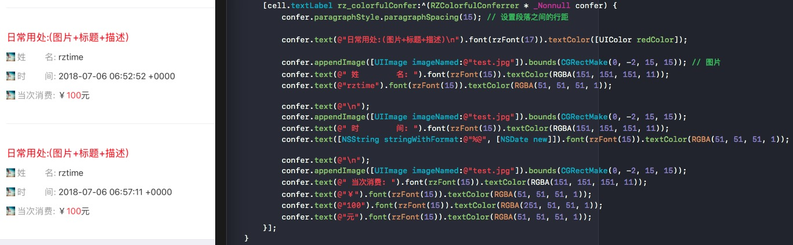
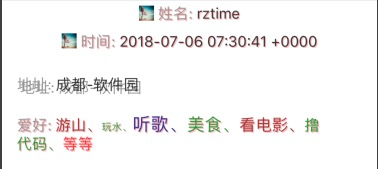

# RZColorful
NSAttributedString 富文本方法 (图文混排、多样式文本)

swift版本[RZColorfulSwift](https://github.com/rztime/RZColorfulSwift)

* NSAttributedString 的多样化设置(文字字体、颜色、阴影、段落样式、url、下划线，以及图文混排等等)
* 添加UITextField、UITextView、UILabel的attributedText的富文本设置。
* 扩展：添加一个刷新界面时保持文本框焦点的方法 [demo查看](https://github.com/rztime/ContinueFirsterResponder)
* 富文本方法内容可单独抽出来,在下边这个文件夹中
```
#import "NSAttributedString+RZColorful.h"
```

## 关于RZColorful
* 支持UILabel、UITextView、UITextField的attributedText的设置。
* 支持获取NSAttributedString中的图片
* 支持 HTML 与 NSAttributedString互换（支持图片）
* 包含的属性快捷设置：
    * 段落样式
    * 阴影
    * 文本字体、颜色
    * 文本所在区域对应的背景颜色
    * 连体字
    * 字间距
    * 删除线、下划线，及其线条颜色
    * 描边，及其颜色
    * 斜体字
    * 拉伸
    * 上下标
    * 书写方向（从左到右，从右到左）
    * 通过html源码加载富文本
    * 通过url添加图片到富文本

## How to use
* 添加代码到项目中
```objc
pod ‘RZColorful’
```

* 请在需要使用的地方加上

```objc
#import "RZColorful.h"
```

* 主要的功能：
    * RZColorfulConferrer 
        * text                                -- 添加文本
        * appendImage                -- 添加图片
        * htmlText                         -- 添加html源码
        * appendImageByUrl        -- 添加图片（通过图片的URL添加）
        * paragraphStyle              -- 全局的段落样式
        * shadow                          -- 全局的阴影样式
        
    * 其中 text、appendImage、appendImageByUrl支持单独设置paragraphStyle、shadow（设置完之后使用and、with等可继续连接设置），此时将覆盖全局的样式，

    * RZColorfulAttribute           -- 设置文本的所有的属性
    * RZImageAttachment         -- 设置图片的所有的属性
    
    
### 基本的简单使用方法
```objc
    [cell.textLabel rz_colorfulConfer:^(RZColorfulConferrer * _Nonnull confer) {
        confer.paragraphStyle.paragraphSpacing(15); // 设置段落之间的行距

        confer.text(@"日常用处:(图片+标题+描述)\n").font(rzFont(17)).textColor([UIColor redColor]);

        confer.appendImage([UIImage imageNamed:@"test.jpg"]).bounds(CGRectMake(0, -2, 15, 15)); // 图片
        confer.text(@" 姓        名: ").font(rzFont(15)).textColor(RGBA(151, 151, 151, 11));
        confer.text(@"rztime").font(rzFont(15)).textColor(RGBA(51, 51, 51, 1));

        confer.text(@"\n");
        confer.appendImage([UIImage imageNamed:@"test.jpg"]).bounds(CGRectMake(0, -2, 15, 15));
        confer.text(@" 时        间: ").font(rzFont(15)).textColor(RGBA(151, 151, 151, 11));
        confer.text([NSString stringWithFormat:@"%@", [NSDate new]]).font(rzFont(15)).textColor(RGBA(51, 51, 51, 1));

        confer.text(@"\n");
        confer.appendImage([UIImage imageNamed:@"test.jpg"]).bounds(CGRectMake(0, -2, 15, 15));
        confer.text(@" 当次消费: ").font(rzFont(15)).textColor(RGBA(151, 151, 151, 11));
        confer.text(@"￥").font(rzFont(15)).textColor(RGBA(51, 51, 51, 1));
        confer.text(@"100").font(rzFont(15)).textColor(RGBA(251, 51, 51, 1));
        confer.text(@"元").font(rzFont(15)).textColor(RGBA(51, 51, 51, 1));
    }];
```
效果如下
<p align="center" >
    
</p>

### 段落样式、阴影（局部与全局统一的区别）
如果设置有局部样式，则全局样式无效
```objc
    [cell.textLabel rz_colorfulConfer:^(RZColorfulConferrer * _Nonnull confer) {
        confer.paragraphStyle.lineSpacing(5).paragraphSpacingBefore(5).alignment(NSTextAlignmentCenter); // 段落全局样式
        confer.shadow.color(RGBA(255, 0, 0, 0.3)).offset(CGSizeMake(1, 1));   // 阴影全局
        
        // 此部分显示全局样式的风格 （红色阴影，居中对齐，段落行距等）
        confer.appendImage([UIImage imageNamed:@"test.jpg"]).bounds(CGRectMake(0, -2, 15, 15));
        confer.text(@" 姓名: ").font(rzFont(15)).textColor(RGBA(151, 151, 151, 11));
        confer.text(@"rztime").font(rzFont(15)).textColor(RGBA(51, 51, 51, 1));
        
        confer.text(@"\n");
        confer.appendImage([UIImage imageNamed:@"test.jpg"]).bounds(CGRectMake(0, -2, 15, 15));
        confer.text(@" 时间: ").font(rzFont(15)).textColor(RGBA(151, 151, 151, 11));
        confer.text([NSString stringWithFormat:@"%@", [NSDate new]]).font(rzFont(15)).textColor(RGBA(51, 51, 51, 1));
        
        // 此部分显示全局样式的风格 （居中对齐，段落行距等）  阴影将被局部覆盖（灰色）
        confer.text(@"\n地址: ").font(rzFont(15)).textColor(RGBA(151, 151, 151, 11)).paragraphStyle.paragraphSpacingBefore(20).and.shadow.color(GRAY(151)).offset(CGSizeMake(3, 3));;
        confer.text(@"成都-软件园").font(rzFont(15)).textColor(RGBA(51, 51, 51, 1)).shadow.color(GRAY(151)).offset(CGSizeMake(3, 3));
        
        // 此部分段落样式被局部覆盖  阴影显示全局的
        confer.text(@"\n爱好: ").font(rzFont(15)).textColor(RGBA(151, 151, 151, 11)).paragraphStyle.paragraphSpacingBefore(20);
        confer.text(@"游山、").font(rzFont(15)).textColor(RGBA(151, 51, 51, 1));
        confer.text(@"玩水、").font(rzFont(10)).textColor(RGBA(51, 151, 51, 1));
        confer.text(@"听歌、").font(rzFont(18)).textColor(RGBA(51, 51, 151, 1));
        confer.text(@"美食、").font(rzFont(17)).textColor(RGBA(51, 151, 51, 1));
        confer.text(@"看电影、").font(rzFont(16)).textColor(RGBA(151, 51, 51, 1));
        confer.text(@"撸代码、").font(rzFont(15)).textColor(RGBA(51, 151, 51, 1));
        confer.text(@"等等\n\n").font(rzFont(15)).textColor(RGBA(251, 51, 51, 1));
    }];
```
效果如下
<p align="center" >

</p>

通过url加载图片
```objc
    [cell.textLabel rz_colorfulConfer:^(RZColorfulConferrer * _Nonnull confer) {
        confer.appendImageByUrl(@"http://pic28.photophoto.cn/20130830/0005018667531249_b.jpg").bounds(CGRectMake(0, 0, 200, 0)).paragraphStyle.alignment(NSTextAlignmentLeft); // 宽或高为0时，即自动宽/高按照图片比例来
    }];
```
通过html源码加载文本
```objc
[cell.textLabel rz_colorfulConfer:^(RZColorfulConferrer * _Nonnull confer) {
    NSString *resourcePath = [[NSBundle mainBundle] resourcePath];
    NSString *filePath =[resourcePath stringByAppendingPathComponent:@"test.html"];
    NSString *htmlstring=[[NSString alloc] initWithContentsOfFile:filePath encoding:NSUTF8StringEncoding error:nil];
    confer.htmlText(htmlstring);
}];
```

# 备注：
    * 多种属性使用名请参考对应的文件。
    * UILabel、UITextFile是同样的使用方法。
    * 在UILabel、UITextFiled上url点击方法无效。
    * 在UITextView中若要添加url且可点击方法，请先设置其editable = NO,并实现代理。


```objc
- (BOOL)textView:(UITextView *)textView shouldInteractWithURL:(NSURL *)URL inRange:(NSRange)characterRange interaction:(UITextItemInteraction)interaction {
    NSLog(@"URL:%@", URL);
    // return NO;则不跳转，这里可以做一些基本判断在执行是否跳转浏览器打开url
    return YES; 
}
```

## 注意

* 尽管我已经在代码中已经处理过（弱）引用问题，但是在实际运用写入text时，还是请尽量检查避免循环引用


## 最后
* 在使用过程中，如果您发现有什么问题，欢迎向我反馈，谢谢
